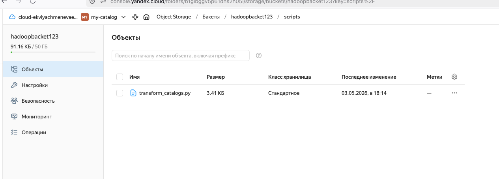
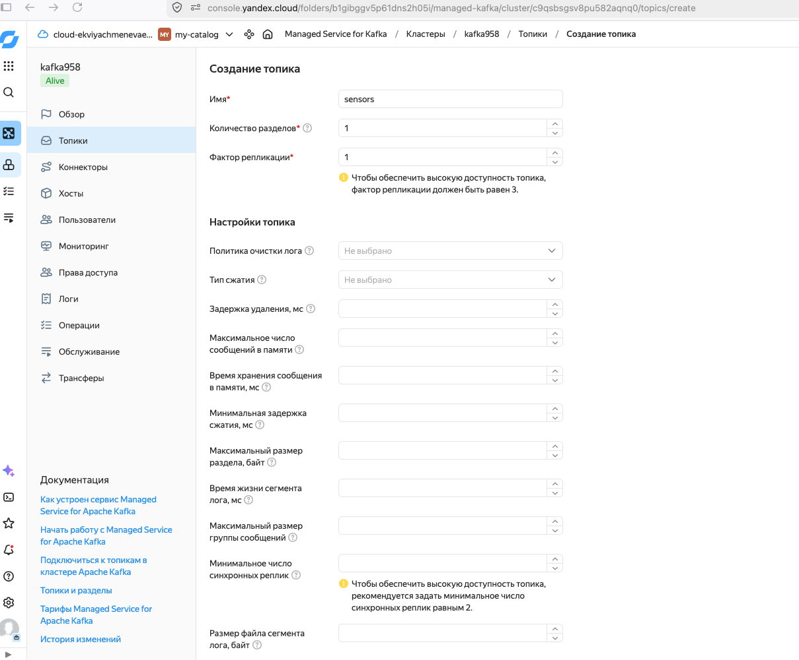
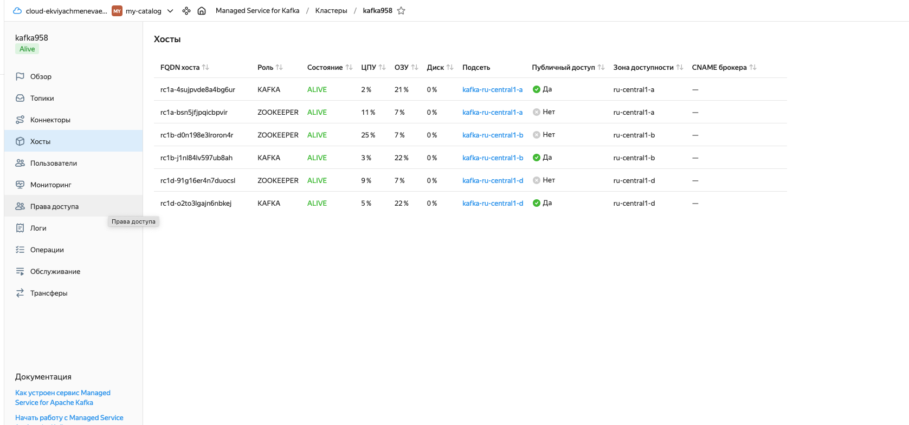
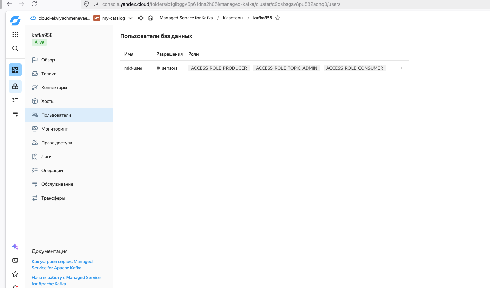
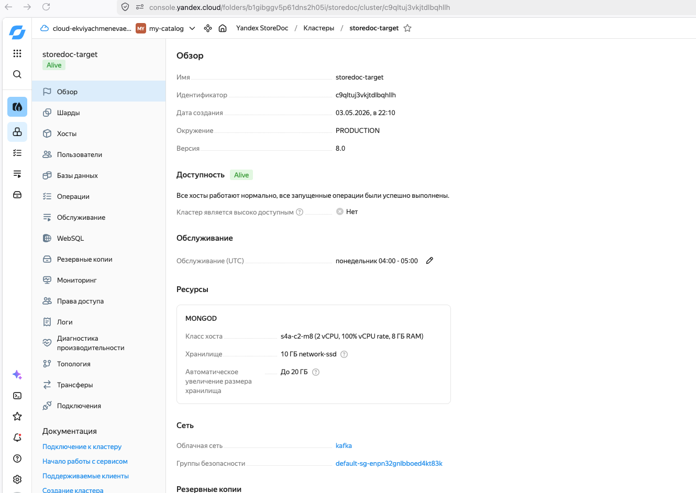
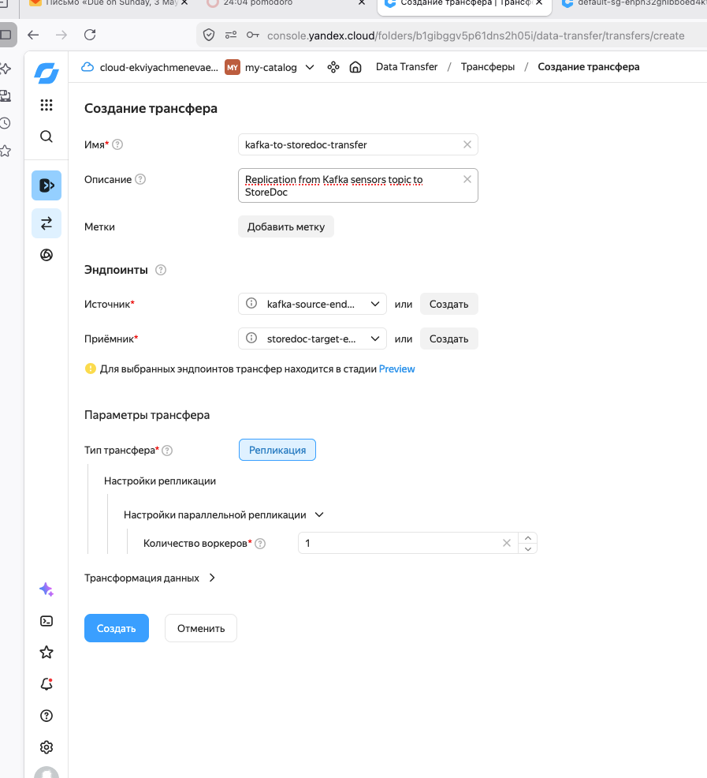
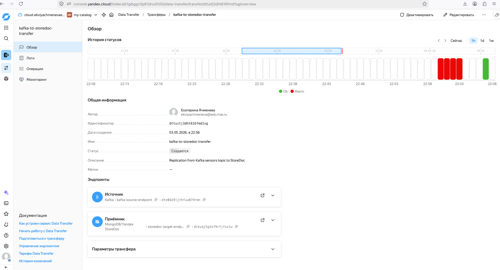
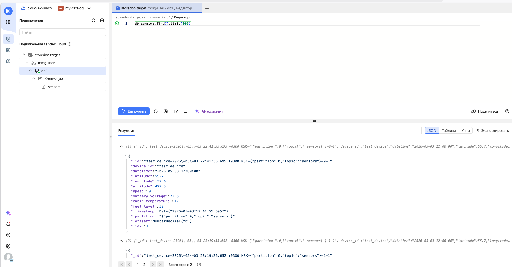
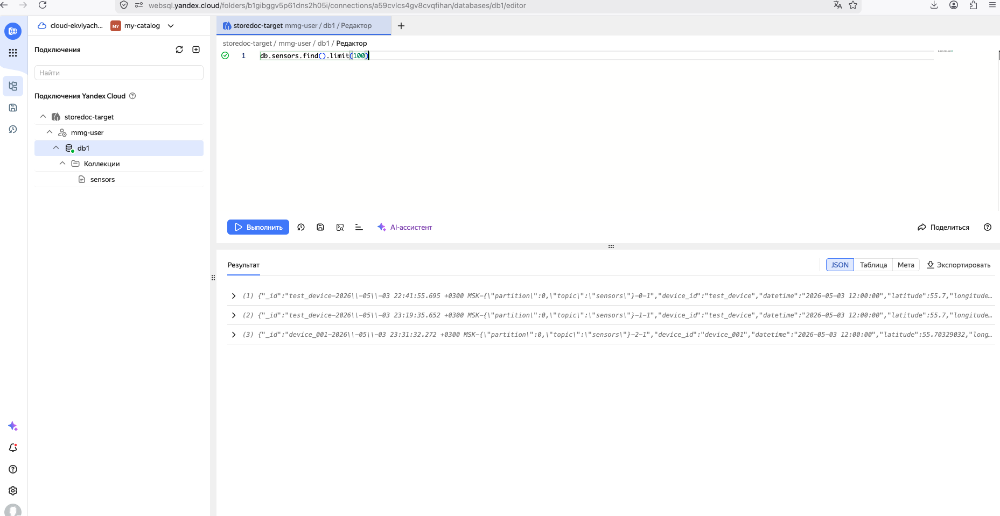
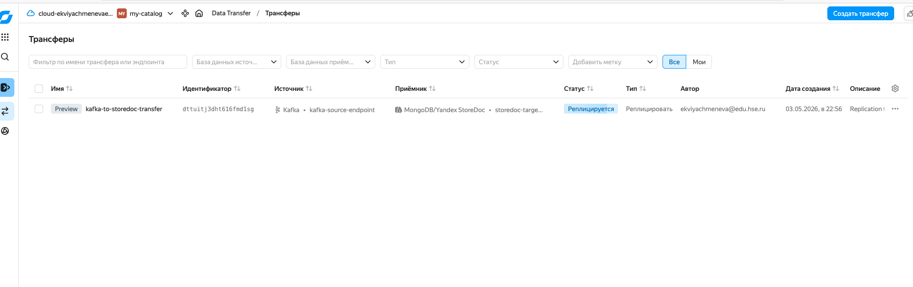

# etl_module3_webinar11_12

## Часть 1. Работа с big data

### Описание задания

Повторить работу из демонстрации вебинара «Работа с big data»:

1. Развернуть кластер Hadoop и Spark с помощью Yandex Data Processing.
2. Загрузить данные для обработки.
3. Провести трансформацию данных и записать результат в Yandex Data Processing / Object Storage.

### Выполнение

В рамках задания был подготовлен входной файл `catalog_offers.json`, загружен PySpark-скрипт `transform_catalogs.py`, после чего в Yandex Data Processing было создано и запущено задание типа PySpark.

Скрипт читает исходный JSON, разбирает сущности `catalogs` и `offers`, формирует плоскую структуру данных, рассчитывает процент скидки для предложений и записывает результат в формате JSON в выходную директорию Object Storage.

### Скриншоты

#### 1. Загрузка исходных данных

В бакет Object Storage загружен файл `catalog_offers.json`, который используется как входной набор данных для обработки.

#### 2. Загрузка PySpark-скрипта

В директорию `scripts` бакета загружен файл `transform_catalogs.py` с логикой трансформации данных.

#### 3. Проверка загруженного скрипта

Скрипт доступен в Object Storage и может быть указан как основной Python-файл при создании задания в Yandex Data Processing.

#### 4. Создание задания PySpark

В Yandex Data Processing создано задание типа `PySpark`. В качестве аргументов переданы путь к входному файлу и путь для записи результата:

- `s3a://hadoopbucket123/input/catalog_offers.json`
- `s3a://hadoopbucket123/output/catalog_offer_mart_json_final`

#### 5. Успешное выполнение задания

Задание выполнилось со статусом `Done`. В логах отображается запуск Spark-приложения и параметры выполнения.

#### 6. Результат трансформации

После выполнения задания в выходной директории Object Storage появились файл `_SUCCESS` и JSON-файл с результатом обработки.

## Часть 2. NoSQL в ETL-процессах

### Описание задания

Повторить работу из демонстрации вебинара «NoSQL в ETL-процессах».

В кластер Yandex StoreDoc можно в реальном времени поставлять данные из топиков Apache Kafka. Для запуска поставки данных необходимо:

1. Подготовить тестовые данные.
2. Подготовить и активировать трансфер.
3. Проверить работоспособность трансфера.

### Выполнение

Для проверки поставки данных был подготовлен файл `sample.json` с тестовыми сообщениями от датчиков. В Managed Service for Apache Kafka был создан топик `sensors`, а также пользователь `mkf-user` с правами на запись, чтение и администрирование топика.

В качестве приемника был подготовлен кластер Yandex StoreDoc `storedoc-target`. Затем в Yandex Data Transfer был создан трансфер `kafka-to-storedoc-transfer`, который реплицирует сообщения из Kafka-топика `sensors` в Yandex StoreDoc.

### Скриншоты

#### 1. Создание Kafka-топика

В кластере Managed Service for Apache Kafka создан топик `sensors` с одним разделом и фактором репликации `1`.

#### 2. Проверка хостов Kafka-кластера

Хосты Kafka и ZooKeeper находятся в статусе `ALIVE`, что подтверждает работоспособность кластера перед настройкой трансфера.

#### 3. Настройка пользователя Kafka

Для работы с топиком создан пользователь `mkf-user`, которому выданы роли `ACCESS_ROLE_PRODUCER`, `ACCESS_ROLE_TOPIC_ADMIN` и `ACCESS_ROLE_CONSUMER`.

#### 4. Подготовка приемника Yandex StoreDoc

Создан кластер Yandex StoreDoc `storedoc-target`, который используется как приемник данных из Kafka.

#### 5. Создание трансфера

В Yandex Data Transfer создан трансфер `kafka-to-storedoc-transfer`. В качестве источника выбран Kafka endpoint, в качестве приемника - endpoint Yandex StoreDoc.

#### 6. Проверка работы трансфера

На странице трансфера отображаются источник Kafka, приемник MongoDB/Yandex StoreDoc и история статусов. Это подтверждает, что трансфер создан и запущен для передачи данных.

#### 7. Проверка данных в Yandex StoreDoc

В редакторе WebSQL выполнен запрос `db.sensors.find().limit(100)` к коллекции `sensors`. В результате отображаются документы, поступившие из Kafka-топика.

#### 8. Просмотр записей коллекции sensors

Коллекция `sensors` содержит несколько записей с данными датчиков. Это подтверждает, что сообщения были доставлены в приемник Yandex StoreDoc.

#### 9. Статус репликации трансфера

В списке трансферов `kafka-to-storedoc-transfer` находится в статусе `Реплицируется`, источник указан как Kafka, а приемник - MongoDB/Yandex StoreDoc.

